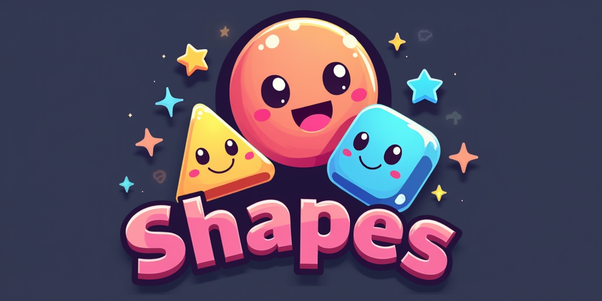
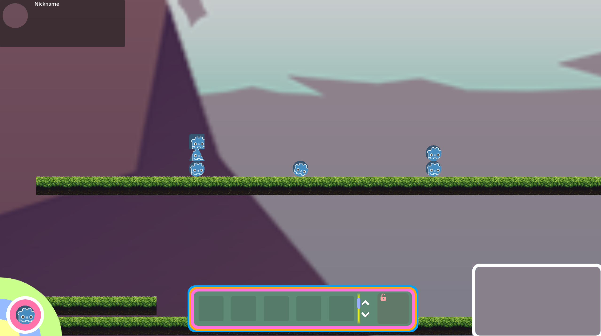

<a name="readme-top"></a>

<!-- PROJECT LOGO -->
<br />
<div align="center">
  <a href="https://github.com/kaylaa0/shapes-game">
	
  </a>
  <p align="center">
	<h3 align="center">Shapes Game</h3>
	<a href="https://github.com/kaylaa0/shapes-game/wiki"><strong>Explore the docs »</strong></a>
	<br />
	<br />
	<a href="https://github.com/kaylaa0/shapes-game">View Demo</a>
	·
	<a href="https://github.com/kaylaa0/shapes-game">Report Bug</a>
	·
	<a href="https://github.com/kaylaa0/shapes-game">Request Feature</a>
  </p>
</div>

<!-- TABLE OF CONTENTS -->
<details>
  <summary>Table of Contents</summary>
  <ol>
	<li>
	  <a href="#about-the-project">About The Project</a>
	  <ul>
		<li><a href="#built-with">Built With</a></li>
	  </ul>
	</li>
	<li>
	  <a href="#getting-started">Getting Started</a>
	  <ul>
		<li><a href="#prerequisites">Prerequisites</a></li>
		<li><a href="#installation">Installation</a></li>
	  </ul>
	</li>
	<li><a href="#usage">Usage</a></li>
	<li><a href="#roadmap">Roadmap</a></li>
	<li><a href="#contact">Contact</a></li>
	<!--<li><a href="#acknowledgments">Acknowledgments</a></li>-->
  </ol>
</details>

<!-- ABOUT THE PROJECT -->

## About The Project

Shapes Game is a 2D strategy game where players engage in base defense and resource management using shapes with unique mechanics. Players explore the map, strategize with various shapes, and build structures to protect their base from opponents. 

<div align="center">
  
</div>

Developed in Godot Engine, Shape Game combines strategic planning with dynamic gameplay.

<!-- BUILT WITH -->

### Built With

* [![Godot][Godotengine.org]][Godot-url]

<!-- GETTING STARTED -->

## Getting Started

### Prerequisites

1. [Godot 4.2.2](https://godotengine.org/)

### Installation

1. Clone the repo
   ```sh
   git clone https://github.com/kaylaa0/roslay.git
   ```

2. Open the project in Godot Engine

3. Run the project in Godot Engine (or build the project)

<!-- USAGE GUIDE -->

## Usage

  Refer to the `Wiki` for detailed documentation on the [Controls and Guide](https://github.com/kaylaa0/shapes-game/wiki/)


<!-- ROADMAP -->

## Roadmap

- [x] Create README.md
- [&ensp;] Fill in the Wiki with documentation
- [&ensp;] Add multiplayer functionality
- [&ensp;] Refine game assets


<!-- LICENSE 
## License

<br />
<div style="display: flex; align-items: center;">
  
  <span style="margin-left: 10px;">This work is licensed under a <a rel="license" href="http://creativecommons.org/licenses/by-nc-nd/4.0/">Creative Commons Attribution-NonCommercial-NoDerivatives 4.0 International License</a>.</span>
</div>
<br />

See `LICENSE.md` for more information.-->

<!-- CONTACT -->

## Contact

Kayla Akyüz - kaylakyuz@gmail.com

Project Link: [GitHub](https://github.com/kaylaa0/shapes-game)

[![LinkedIn][linkedin-shield]][linkedin-url]

<!-- ACKNOWLEDGMENTS 
## Acknowledgments


* Thanks to for the amazing 2D assets.
-->

<p align="right">(<a href="#readme-top">back to top</a>)</p>

<!-- MARKDOWN LINKS & IMAGES -->

[linkedin-shield]: https://img.shields.io/badge/-LinkedIn-black.svg?style=for-the-badge&logo=linkedin&colorB=0077B5&colorA=0077B5
[linkedin-url]: https://www.linkedin.com/in/-kayla-/
[product-screenshot]: images/screenshot.png
[Godotengine.org]: https://img.shields.io/badge/Godot-%23FFFFFF.svg?logo=godot-engine&style=for-the-badge
[Godot-url]: https://godotengine.org/
